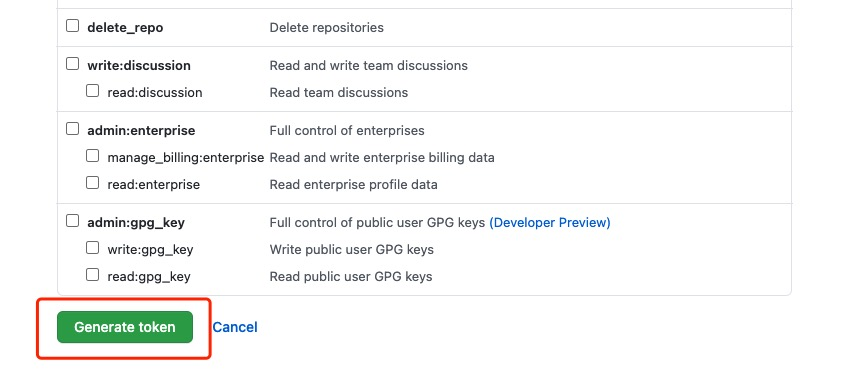

## 引言

大多数人通常都会把自己的个人博客部署到**Github**并新建一个博客仓库，使用`master`分支来管理文章和代码，`xxx`分支存放生成的静态文件。在之前我本人一直使用的是*Travis CI*来进行部署，但是国内不知道为什么经常被墙，需要科学上网才能正常使用，遂决定换为*Github Actions*来进行部署。

不管是使用*Travis CI*还是*Github Actions*来进行部署，其主要目的都是为了减少手动部署的操作步骤。

## 说明
本文档主要是针对*Github Actions*的部署流程进行讲解，默认对*Github Pages*不做相关阐述。
关于*GitHub Pages*的介绍，可参考阮一峰老师的[《搭建一个免费的，无限流量的Blog----github Pages和Jekyll入门》](http://www.ruanyifeng.com/blog/2012/08/blogging_with_jekyll.html)

## 项目中使用

::: tip
如果是第一次使用*Github Actions*建议参考官方文档[github-actions](https://github.com/features/actions)或者阮一峰老师的[GitHub Actions 入门教程](http://www.ruanyifeng.com/blog/2019/09/getting-started-with-github-actions.html?hmsr=codercto.com&utm_medium=codercto.com&utm_source=codercto.com)
:::

### 配置Personal Access Token


一般勾选这几个权限就够了，如果有特殊需求和配置，可参考[官方文档](https://docs.github.com/en/github/authenticating-to-github/keeping-your-account-and-data-secure/creating-a-personal-access-token)


点击Generate token生成新的token


复制生成的token值


点击*Github Pages*仓库Settings下的Secrets将生成的token值粘贴进Value

## 添加.github相关配置
在项目根目录下新建.github/workflows目录，workflows目录下新建deploy.yml文件，部署时github会自动运行workflows目录下的yml文件

```
on: # 触发条件
  # 每当 push 到 master 分支时触发部署
  push:
    branches: [master]
jobs:
  build-and-deploy:
    runs-on: ubuntu-latest
    steps:
    - name: Checkout
      uses: actions/checkout@master

    - name: Build and Deploy
      uses: jenkey2011/vuepress-deploy@master
      env:
        ACCESS_TOKEN: ${{ secrets.ACCESS_TOKEN }}
        # 部署分支
        TARGET_BRANCH: host-pages
        BUILD_SCRIPT: yarn && yarn build
        # 打包输出目录
        BUILD_DIR: public

```

现在push到master分支会自动进行打包构建并部署到host-pages分支，部署的日志可在仓库的Actions里看到

