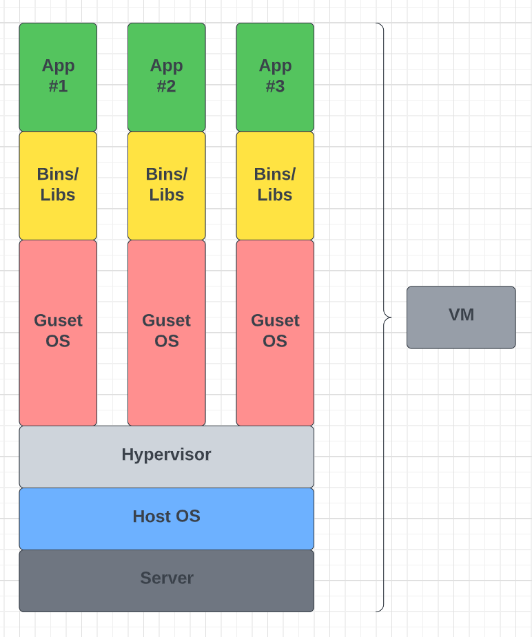
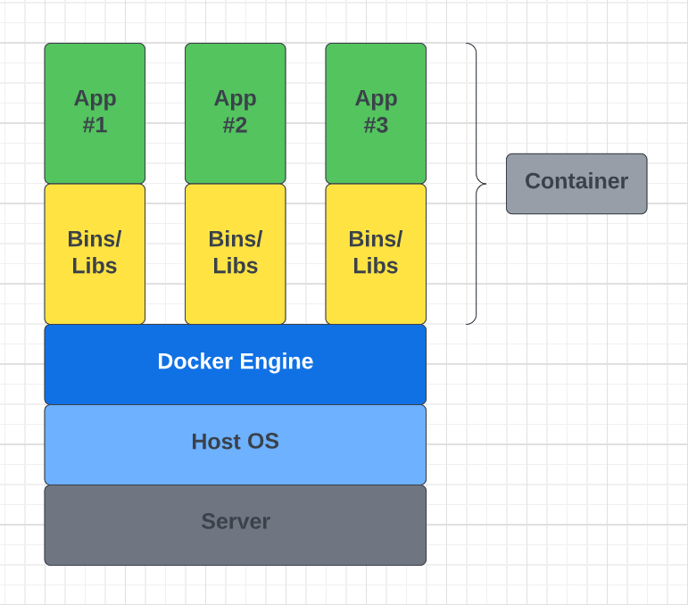

## 引言

&emsp;&emsp;如果你是一名开发者，我想你一定听说过`Docker`（一个在“容器”中打包、运输和运行应用程序的工具。）对于大多数开发者来说，应该没有人会拒绝使用Docker。目前很多知名的大厂（Google, VMware, Amazon,etc），都在用它来构建自己的应用服务。

&emsp;&emsp;不论你是否在实际的开发过程中使用过`Docker`，我认为了解一些基础概念，关于什么是`容器`以及它与`虚拟机`之间的差异，这仍然是很重要的。虽然网络上目前充斥着很多`Docker`的优秀使用指南，但目前我没找到比较适合初学者的一些概念及入门指南，尤其是关于容器的组成部分。希望这篇博客能帮助初学者解决这个困扰。

## 什么是容器和虚拟机？

&emsp;&emsp;容器和虚拟机要做的事情都很相似： 将应用程序及其依赖项隔离为一个可以在任何地方运行的独立单元。此外，容器和虚拟机消除了对物理硬件的需求，允许在能耗和成本效益方面更有效地使用计算资源。容器和VM之间的主要区别在于它们的架构体系。接下来，让我们仔细看看。

### 虚拟机
&emsp;&emsp;虚拟机——通过软件模拟的具有完整硬件系统功能的、运行在一个完全隔离环境中的完整计算机系统。在实体计算机中能够完成的工作在虚拟机中都能够实现。虚拟机使用`管理程序`在物理机器上运行。管理程序反过来在主机或`裸机`上运行。

&emsp;&emsp;`虚拟机监控程序（VMM）`是虚拟机在其上运行的软件、固件或硬件。管理程序本身运行在物理计算机上，称为`主机`。主机为VM提供资源，包括`RAM`和`CPU`。这些资源在虚拟机之间根据需要进行分配。因此，如果一个虚拟机正在运行一个资源量更大的应用程序，那么将会为该虚拟机分配比在同一主机上运行的其他虚拟机更多的资源。

&emsp;&emsp;在主机上运行的VM通常也被称为`客户机`。该`客户机`包含应用程序以及运行该应用程序所需的内容（例如系统二进制文件和库）。不仅如此`客户机`还拥有自己的整个虚拟化硬件堆栈，包括虚拟化网络适配器、存储和CPU，这意味着`客户机`也有着自己配套的操作系统。从内部来看，`客户机`作为自己的单元，拥有自己的专属资源。从外部来看，我们知道它是一个VM，共享着主机提供的资源。如上所述，客户机可以在托管管理程序或裸机管理程序上运行。但是在两者之间，也有一些重要的区别。

&emsp;&emsp;首先，托管虚拟化管理程序在主机的操作系统上运行。比如运行OSX的计算机可以在该操作系统上安装VM（例如VirtualBox或VMware Workstation 8）。VM无法直接访问硬件，因此必须通过主机操作系统进行访问（Mac的OSX）。托管管理程序的好处是底层硬件不那么重要，主机的操作系统负责硬件驱动程序，而不是管理程序本身，因此被认为具有更多的“硬件兼容性”。另一方面，硬件和管理程序之间的这一额外层会产生更多的资源开销，从而降低虚拟机的性能。

&emsp;&emsp;裸机管理程序环境通过在主机硬件上安装和运行来解决性能问题。因为它直接与底层硬件对接，所以它不需要主机操作系统来运行。在这种情况下，作为操作系统安装在主机服务器上的第一件事就是管理程序。与托管管理程序不同，裸机管理程序有自己的设备驱动程序，并直接与每个组件交互以执行任何I/O、处理或操作系统特定的任务。这将带来更好的性能、可扩展性和稳定性。这里的折衷是硬件兼容性有限，管理程序只能内置这么多设备驱动程序。说了那么多关于管理程序的内容之后，你可能会想知道为什么我们需要在VM和主机之间添加额外的`管理程序`层。

&emsp;&emsp;原因是由于虚拟机有自己的虚拟操作系统，管理程序在为虚拟机提供管理和执行该客体操作系统的平台方面发挥了重要作用。它允许主机在其上作为客体运行的虚拟机之间共享其资源。

VM示意图

正如图中所示，为每个新的虚拟机打包了虚拟硬件、内核（即操作系统）和用户空间。

### 容器
&emsp;&emsp;与提供硬件虚拟化的VM不同，容器通过抽象“用户空间”来提供操作系统级虚拟化。无论出于何种目的，容器看起来就像VM。例如，他们有执行所需的专有空间，可以以root的身份执行命令，有专有的网络接口和IP地址，并允许自定义路由和防火墙规则，可以装载文件系统等等。
:::tip
**容器和VM之间的最大区别在于，容器可以与其他容器共享主机系统的内核**
:::

Container示意图

&emsp;&emsp;从上面的示意图中我们不难看出，容器仅将用户空间进行打包，而不是像虚拟机一样打包了内核或者虚拟硬件。每个容器都有自己的隔离用户空间，并允许多个容器在一台主机上运行。我们可以看到，所有的操作系统级别的架构都是跨容器共享的。唯一从头开始创建的部分是bins和libs。这就是为什么容器如此轻量级的原因。